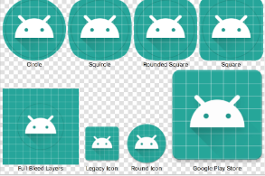
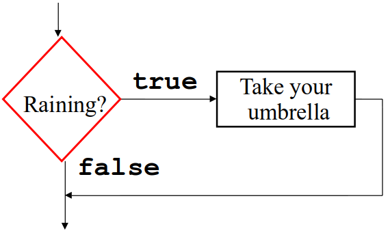
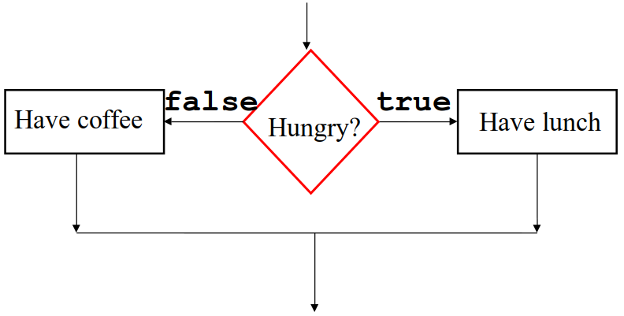

# Icons Decision Making Controls Pt1

    Course Code: ELEE1146 and COMP1836

    Course Name: Mobile Applications for Engineers/Technologists

    Credits: 15

    Module Leader: Seb Blair BEng(H) PGCAP MIET MIHEEM FHEA

---

## The Medical Calculator App


---

## Launcher Icons

The Launcher Icon allows you to view which apps are available

- An icon is a graphic that takes up a small portion of screen space and provides a quick, intuitive representation of an app

- High-quality launcher icons can influence users to purchase your app

- Icons can establish brand identity 
- Icon dimensions are 48 X 48 pixels 
- The prefix ic_launcher is used to name launcher icons for Android apps. 



---

## Radio Buttons and RadioGroups Controls

[Documentation for Radio\<controls\>](https://developer.android.com/reference/android/widget/RadioGroup?hl=en)

A `RadioButton` control selects or deselects an option
- Can be arranged horizontally or vertically (by default)
- Has a label defined by the text property
- Can be initially set to checked or unchecked
- Typically used together in a `RadioGroup`
- Only one `RadioButton` in the group can be selected at a time
- Good to offer a default selection (checked == `true`) for the option that is used most

---

## Changing the Text Color of Android Controls

- Use **hexadecimal color codes** to represent RGB (Red,Green,Blue)
  - [https://htmlcolorcodes.com/](https://htmlcolorcodes.com/)
- Codes range from `00` to `FF` (`00` none, `FF` none)
- Codes are indentified by a hashtag sign, followed by the RGB values
  - `#FF0000` is Red
  - `#00FF00` is Green
  - `#0000FF` is Blue
  - `FFFF00` is Yellow (Red + Green )
---

## Changing the Text Color of Android Controls
- You can also choos some basic colours from the Resources dialog
 

---

## Coding a `RadioButton` Control

```kt
class MainActivity : AppCompatActivity() {

  val conversionRate : Double = 2.2
  var weightEntered :  Double = 0.0
  var convertedWeight : Double = 0.0

  override fun onCreate(savedInstanceState: Bundle?) {
    super.onCreate(savedInstanceState)
    setContentView(R.layout.activity_main)
    supportActionBar?.setDisplayShowCustomEnabled(true)
    supportActionBar?.setLogo(R.mipmap.ic_launcher_foreground)
    supportActionBar?.setDisplayShowTitleEnabled(true)
    supportActionBar?.setDisplayUseLogoEnabled(true)

    val kiloToLb = findViewById<RadioButton>(R.id.radiobutton)
    val lbToKilo = findViewById<RadioButton>(R.id.radiobutton2)

    ...
  }
}
```
---
## Control Statements

- To branch the program execution - selection statements
  - `if, if/else, when`
- To repeat actions - loops
  - `while, do ... while, for`
- Boolean expressions to make decisions `true` and `false`
  - Using relational operators
  - Using boolean operators

---

## Relational Operators

<div align=center>

| Relational Operators | Meaning | Example | Resulting Condition |
|---|---|---|---|
|`==`| Equal to | `6 == 6` | True|
|`!=`| Not Equal to | `4 != 7` | True|
|`>`| Greater than | `3 > 2` | True|
|`<`| Less than | `8 < 1` | False|
|`>=`| Greater than or equal to | `5 >= 5` | True|
|`<=`| Less than or Equal to | `9 <= 6` | Flase|

</div>

---

## Logical Operators

<div align=center style="font-size: 24pt">

|Logical Operator | Meaning | Example|
|---|---|---|
|`&&`| And, all conditions must be true| `if(flight <  400 && hotel < 120)`|
|`\|\|`| Or, at least one conditions must be true| `if(stamp < 0.49 \|\| rate == 2)`|
|`!`| Not, reverse the meaning of the condition| `if(! (grade > 70))`|

</div>

---

## Truth Tables

<div align=center>

<table>
<tr>
<td>

|Operator| !Operator|
|---|---|
|value|value|
|`false`|`true`|
|`true`|`false`|

</td>
<td>

</td>
<td>

|Operand1| Operand2| Logocal AND (`&&`)|
|---|---|---|
|`false`|`false`|`false`|
|`false`|`true`|`false`|
|`true`|`false`|`false`|
|`true`|`true`|`true`|
</td>
</tr>
</table>

</div>

---

## Logical Operators Example

```kt
{
    val i1 : Int = 20
    val i2 : Int = 7
    val i3 : Int = 7
    var result: Boolean // default value is false

    result = i1 != i2
    result = i1 != i2 // same as !(i1 == i2)

    result = i1 == i3
    result = i1 > i2 && i1 == i3
    result = i1 > i2 || i1 == i3
}
```
---
## Logical Operators Example 2

```kt
{
  val i1 : Int = 20
  val i2 : Int = 7
  val i3 : Int = 7
  var result: Boolean // default value is false
    
  result = !(i1 == i2); // true
  result = i1 != i2; // true

  result = i1 == i3; // false
  result = i1 > i2 && i1 == i3; // false
  result = i1 > i2 || i1 == i3; // true
}
```
---

## Flow of Control

- The order of statement execution in a program or method is called the **flow of control** 
- Unless specified otherwise, the order of statement execution is linear: one statement after the other in sequence
- Some programming statements modify that order, allowing us to:
  - decide whether to execute a particular statement, or
  - repeat a statement execution over and over
- These decisions are based on **conditions** in the program that evaluates to true or false

---

## Selection Statements

- A **selection statement** lets us choose which statement will be executed next
- Selection statements are sometimes called **conditional statements**
- Selection statements give us the power to make decisions and branch the program execution

- Single Selection 
  - the `if` statement 
- Double Selection 
  - the `if/else` statement 
- Multiple Selection 
  - the `switch` statement 

---

## Single Selection Statement

- `if ( booleanExpr )` statement inside the brackets is the conditional check;
- Example:
  - It is raining outside. Take your umbrella.
Flowchart



---

## The `if` Statement: Examples

```kt
if ( countNumbers == 10 ) print( )

if ( grade >= 90 ) 
  print( “You are an excellent student!” )

if ( account <= creditLimit )
   print( “You have insufficient credit!” )

if ( dayOfTheWeek > 5 )
{
    print( “Time to relax…” )
    print( “Weekend.”)
}
```

---

## Double Selection Statement

- `if( booleanExpr ) statement1 else statement2`
- **Example**
  - If you are hungry - go for lunch, otherwise take a cup of coffee. 
- **Flowchart**


---
## The `if/else` Statement Examples

```kt
if ( dayOfTheWeek > 5 )
{
  print( “Weekend.”)
  print( “Time to relax…” )
}
else 
{
  print( “Workday.”)
  print( “Go to work!” )
}
```

---

## Statement Example

```kt
val grade : Char = ‘A’;

if ( grade == ‘A’) 
  print( “Excellent mark”)
else 
   if ( grade == ‘B’ ) 
     print( “Very good mark”)
   else
     if ( grade == ‘C’ )
       print( “Average mark”)
     else
       if ( grade == ‘D’ ) 
         print( “Below average mark”)
       else print(“Failing mark”)
```
---

## Multiple Selection Statment

```kt
when ( Expression ){
  case_value -> statement1
  case_value -> statement2
  …
  case_valueN -> statementN
  else -> { 
    statementD
  }
}

```

---
## The `when` Statement: Example

```kt
when (grade) {
    'A' -> print("Excellent mark")
    'B' -> print("Very good mark")
    'C' -> print("Average mark")
    'D' -> print("Below average mark")
    else -> {
        print("Failing mark")
    }
}

```

---

## Auto Increment and Decrement

- The increment and decrement operators are unary arithmetic operators with integer operand
- The auto increment operator (`++`) adds one to its operand
- The auto decrement operator (`--`) subtracts one from its operand
- The statement
			`var++;`
	is functionally equivalent to
			`var = var + 1;`

---
## Data Validation and Toast Notifications

- **Data Validation**
  - User entries must be checked for reasonable values
- **Toast Notification**
  - A toast notification communicates messages to the user (message slides upward into view like toast popping out of a toaster)

```kt
Toast toast = Toast.makeText(context, text, duration).show()
...
Toast.makeText(this, "Pounds must be less than 500", Toast.LENGTH_LONG).show()
```
---

## Using the `isChecked()` Method of `RadioButton` Controls

- The `isChecked()` method determines if the `RadioButton` object has been selected
  
```java
if (lbToKilo.isChecked){
  // Statements completed if condition is true
}
else{
  // Statements completed if condition is false
}
```

---

## Coding the Button Event

- The syntax `weight.getText().toString().toDouble()` converts input to a `Double` data type 


```kt
convert.setOnClickListener {
    val weightEntered : Double  = weight.getText().toString().toDouble()
    ...
}
```
---

## Coding the Nested `if` Statements

- If statements are embedded/nested when one if statement is inside of another if statement

```kt
convert.setOnClickListener {
  weightEntered = weight.getText().toString().toDouble()
  val tenth : DecimalFormat = DecimalFormat("#.#")

  if (lbToKilo.isChecked()) {
      if (weightEntered <= 500) {
          convertedWeight = weightEntered / conversionRate
          result.setText(tenth.format(convertedWeight) + " kilograms")
      } else {
          Toast.makeText(this,"Pounds must be less than 500",Toast.LENGTH_LONG
          ).show()
      }
      ...
  }
}
```
---
## Coding the Nested `if` Statements

```kt

 if(lbToKilo.isChecked()){
    if (weightEntered <= 500){
      convertedWeight = weightEntered / conversionRate;
      result.setText(tenth.format(convertedWeight)+ " kilograms");
    } else{
      Toast.makeText(this, "Pounds must be less than 500", Toast.LENGHT_LONG).show();
    }
    lbToKilo.setChecked(false);
 }

 if(kiloToLb.isChecked()){
    if (weightEntered <= 225){
      convertedWeight = weightEntered / conversionRate;
      result.setText(tenth.format(convertedWeight)+ " pounds");
    } else{
      Toast.makeText(this, "Kilos must be less than 225", Toast.LENGHT_LONG).show();
    }
    lbToKilo.setChecked(false);
 }
```
 ---

 ## `Map`

 - `Map` is a **collection** that contains pairs of objects (key, value)
- The first value of the pair is the key and the second is the value of the corresponding key.
- If multiple pair have same key then map will return the last pair value.
- The map entries is traversed in the specified order.
 - ```kt
   fun main(args : Array<String>)
   {
	    // declaring a map of integer to string
	    val map = mapOf(1 to "University", 2 to "of", 3 to "Greenwich")
		  // printing the map
		  println(map)
   }
   ```
   ```
   {1=University, 2=of, 3=Greenwich}
   ```


--- 

## `map`

```kt

fun main(args: Array<String>)
{
    //declaring a map of integer to string
    val map = mapOf(1 to "Proud", 2 to "to" , 3 to "be", 4 to "Gre")
    println("Map Entries : "+map)
    println("Map Keys: "+map.keys )
    println("Map Values: "+map.values )
}
```

<details>

<summary>Output</summary>

```
Map Entries : {1=Proud, 2=to, 3=be, 4=Gre}
Map Keys: [1, 2, 3, 4]
Map Values: [Proud, To, Be, Gre] 
```

</details>

--- 

## `map` and `repeat()`

```kt
val lyricalGenius = mapOf("Greeting" to "Hi, ", "Statement" to "my name is, ",
    "InterrogativeProNoun" to "What?","InterrogativeProNoun2" to "Who?",
    "Alliteration" to "chka-chka,","Name" to "Slim Shady" )

print(lyricalGenius["Greeting"])

// Use a repeat function to iterate over the collection three times
repeat(2) { i ->
    if (i == 0) {
        print(lyricalGenius["Statement"])
    }
    else {
        // Print the greeting and statement values
        print(lyricalGenius["Statement"].toString().capitalize())
        // Print the interrogative pronoun value based on the iteration index
        print(lyricalGenius[if (i % 2 == 0) "InterrogativeProNoun" else "InterrogativeProNoun2"] + " ")
    }
}
// Print the alliteration and name values
print( "\n"+lyricalGenius["Statement"].toString().capitalize()+ " " 
        + lyricalGenius["Alliteration"] + " " + lyricalGenius["Name"] +"\n")
```

<details>
<summary>Output</summary>

<div style="font-size:20px">

```
Hi, my name is, My name is, Who? 
My name is, chka-chka, Slim Shady
```

</div>

</details>