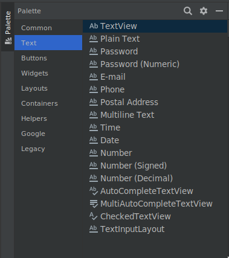

# Input Variables Operations Pt1

    Course Code: ELEE1146 and COMP1836

    Course Name: Mobile Applications for Engineers/Technologists

    Credits: 15

    Module Leader: Seb Blair BEng(H) PGCAP MIET MIHEEM FHEA

---

## The result of the lab


---

## Android Themes

- A **theme** is a style applied to an Activity or an entire application
    - Themes are Android’s mechanism for applying a consistent style to an app or Activity
    - The style specifies the visual properties of the elements that make up a user interface, such as colour, height, padding, and font size
    - Some themes change the background wallpaper of the Activity, while others hide the title bar or display an action bar
    - Some themes display a background depending on the size of the mobile device
  - You can preview themes in the emulator in `activity_main.xml`
  - By changing the theme in the emulator in `activity_main.xml` file, you can preview what the theme looks like, but to change it permanently in the application, you must define the themes in the `themes.xml` file within the values subfolder of the Activity

---

## Simplifying User Input

- Users can enter text in multiple ways on Android phone:
    - Through an onscreen soft keyboard
    - An attached flip button hard keyboard
    - Voice-to-text capabilities on most phone models
  
- The onscreen keyboard is called a soft keyboard
   - Input can be in the form of tapping or gestures (using two fingers to pan, rotate, or zoom)
   - Primary design challenge is to simplify user experiences
   - Use legible fonts, simplify input, and optimize each device’s capabilities to maximize user experience

---

## Simplifying User Input


- Text Fields are the most common type of mobile 
    - input
    - Can be free-form plain text
    - Numbers (whole/decimals)
    - A person’s name, 
    - password, email, 
    - phone number
    - A date and time
    - Multiline text



---

## Simplifying User Input

- The Concert Tickets app requests the number of concert tickets which is a positive integer number
- There is a variety of Text Fields to choose from in Android Studio 
- By selecting the Number text field, users can enter only positive integers from the keyboard
- This way, the app will not accept letters or symbols from the keyboard, saving developers time for writing data validation code 

---

## Adding a String Array

- In order to define a drop-down list in Android Studio, you will need to define a string-array in `strings.xml`
 - A string array defines a string resource of related items in a central location within `strings.xml`
 - An item defines an individual entry within a string array
    -  As you type the string-array XML code, the Android Studio editor offers suggestions in a panel that can complete the statement

---

## String-Array

```xml
<resources>
    <string name="app_name">Concert Tickets</string>

    <string name="txtTickets">Number of Tickets</string> 
    <string name="prompt">Select Group</string>
    <string name="description">Concert Image</string>
    <string name="btnCost">FIND THE COST</string>

    <string-array name="txtGroup">
        <item>Linkin Park</item>
        <item>Hollywood Undead</item>
        <item>Man with a Mission</item>
        <item>Written by Wolves</item>
    </string-array>
</resources>
```

---

## Setting the Hint Property for a Text Field
- A hint is a short description of a field visible as light-colored 
text (called a watermark)
- When the user clicks the control, the hint is removed, and the user is free to type the requested input


---

## Using the Android Spinner Control

- A **Spinner control** is a widget like a drop-down list for selecting a single item from a fixed list
- The spinner control displays a list of strings called **items** in a pop-up window
- A **prompt**, which can be used to display instructions at the top of the Spinner control, also is stored in strings.xml and is named prompt
- The Spinner property called **entries** connects the String Array to the Spinner control for display in the application
- The prompt property of the Spinner connects to the resource named `@string/prompt`
- The entries property of the Spinner connects to the resources of the string array `@array/txtGroup`
- The actual groups are displayed in the Spinner when the app is executed in the emulator
---

## Coding the widget Classes

- A **variable** is used in programming to contain data that changes during the execution of a program
- `val` variables can be initialized but cannot be changed
**EditText** code assigns input value to variable named **tickets**

```kt
val tickets : EditText = findViewById(R.id.editTextNumber)
```
The Spinner assigns the value from the user’s input to the variable named group

```kt
val group : Spinner = findViewById<Spinner>(R.id.spinner)
```
---

## Variables

- Variables stores values
- Each variable has 
  - an identifier (name) 
  - a type (data type)
    - variable size 
    - range of values
    - the operations that can be performed with this variable type

---

## Declaring the Variables
  - Typically declared at the beginning of an Activity
  - Variables must be declared before you can use them
  - `val` immutable
  - `var` mutable

```kt
private val costPerTicket : Double = 79.99 // immutable
private var numberOfTickets : Int = 0 // mutable
private var totalCost : Double = 0.0
private var groupChoice: String? = null
```

---

## Primitive Data Types

|Type| Size | Signed | Unsigned|
|----|----|----|----|
| `Byte`   | $2^8$    | -127 to 128                | 0 to 255 |
| `Short`  | $2^{16}$ | -32,768 to 32,767            | 0 to 65,535|
| `Int`    | $2^{32}$ | -2,147,483,648 to 2,147,483,647 | 0 to 4,294,967,295| 
| `Long`   | $2^{64}$ | -9,223,372,036,854,775,808 to 9,223,372,036,854,775,807  | 0 to 18,446,744,073,709,551,615| 
| `Float`  | $2^{32}$ | -2,147,483,648 to 2,147,483,647  | 0 to 4,294,967,295| 
| `Double` | $2^{64}$ | -9,223,372,036,854,775,808 to 9,223,372,036,854,775,807  | 0 to 18,446,744,073,709,551,615|

> $2^{128}$ IPv6 340 undecillion

---

## Prespective: $2^{128}$ || 340 Undecillion using Encryption

AES-128 uses a 128-bit key, which means there are $2^{128}$ (approximately $3.4 \cdot 10^{38}$) possible keys. It would take to try all of them at a trillion combinations per second:

<div style="font-size:24px">

$$
\begin{equation*}
 Time (in seconds) = \frac{Number of Possible Keys}{Combinations per Second} = \frac{2^{128}}{1,000,000,000,000} 
\end{equation*}
$$

</div>

Let's calculate this:

<div style="font-size:24px">

$$
\begin{equation*}
\frac{2^{128}}{1,000,000,000,000} \approx 3.4 \cdot 10^{38} \text{ seconds}
\end{equation*}
$$

</div>

To convert this to years, you can use the fact that there are 31,536,000 seconds in a year:

<div style="font-size:24px">

$$
\begin{equation*}
\frac{3.4 \times 10^{38}}{31,536,000} \approx 1.08 \cdot 10^{30} \text{ years}
\end{equation*}
$$

</div>


<!--
-  AES-128 is considered a strong encryption algorithm, and it's designed to resist brute force attacks. Brute force attacks involve trying every possible combination of keys until the correct one is found.

- So, it would take approximately \(1.08 \times 10^{30}\) years to crack AES-128 encryption at a rate of a trillion combinations per second. This is an astronomically long period of time, far exceeding the age of the universe, making AES-128 a very secure encryption standard against brute force attacks with today's technology.
-->
---
## What about Strings

```kt
private var groupChoice: String? = null
```

- String Data Type
  - The String type is a class and not a primitive data type
  - A string can be a character, word, or phrase
  - `?` this is a Nullable type, meaning it can be either a `String` or `null`


---

## `getText()` Method

- Read data stored in the `EditText` control with the `getText()` method

  ```kt 
  numberOfTickets = tickets.getText().toString().toIntOrNull() ?: 0
  ```
- Data is read in as a `String`, by default, hence `toString()` is the only conversion method.
- the extended method, `toIntOrNull() ?` 
  - Parses the `String` as an `Int` number and returns the result or `null` if the string is not a valid representation of a number.
  - or by adding `?: 0` returns zero if `null`
---

## Working with Mathematical Operations

<div align=center>

| Arithmetic Operator | Use |Assignment Statement|
|----|---|---|
| + | Addition | `value = itemPrice + itemTax;`|
| - | Subrtaction | `score = previousScore - 2;`|
| * | Multiplication | `totalCost = costPerTicket * numberOfTickets;`|
| ** | Power | `squared = 10**2`
| / | Division | `average = totalGrade / 5.0;`|
| % | Remainder | `leftOver = widgetAmount % 3;`|
| ++ | Increment (adds 1) | `score++`|
| -- | Decrement (subtracts 1) | `score--`|

</div>

---

## Displaying Android Output

- **`getSelectedItem()` Method**
  - The `getSelectedItem()` method returns the text label of the currently selected Spinner item.

```kt
groupChoice = group.getSelectedItem().toString()
```

- **`selectedItemPosition`**
  - Returns the selected items position between 0 and *n*

```kt
val index = spinner.selectedItemPosition
```

---

## `NumberFormat` and `setText()`

- `NumberFormat`
```kt
val format: NumberFormat = NumberFormat.getCurrencyInstance()

format.currency = Currency.getInstance("GBP") // 230 currencies 
format.maximumFractionDigits = 2
format.minimumFractionDigits = 2
```

- **`setText()` Method**
  - The `setText()` method displays text in a TextView control

  ```kt
  result.setText("Cost for " + groupChoice + " is " + format.format(totalCost))
  ```

**Output**

```
Cost for Written By Wolves is £39.98 
```
