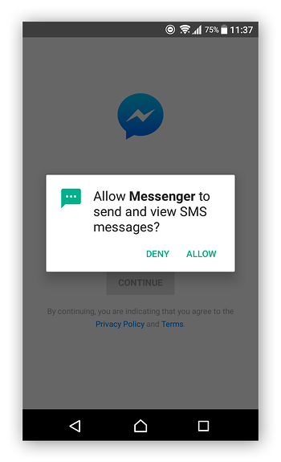
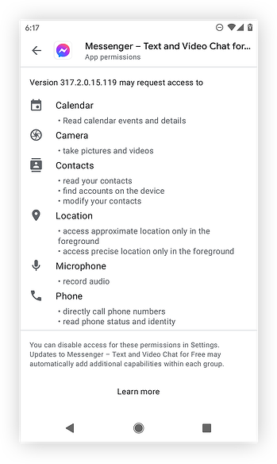

# Permissions

    Course Code: ELEE1146 and COMP1836

    Course Name: Mobile Applications for Engineers/Technologists

    Credits: 15

    Module Leader: Seb Blair BEng(H) PGCAP MIET MIHEEM FHEA

---

## What are Android app permissions?

Android app permissions can give apps control of your phone and access to your camera, microphone, private messages, conversations, photos, and more. App permission requests pop up the first time an app needs access to sensitive hardware or data on your phone or tablet and are usually privacy-related.

---

## Google play Installation notification

If you install a camera app, for example, it will need your permission to access your device’s camera before it can actually take photos.

Other permissions can include:

- monitoring your location,
- saving data, 
- sending and receiving calls and texts, 
- reading sensitive log data,
- accessing your contacts,
- calendar,
- browsing history.

---

##  FB Messenger Example:



Before Facebook Messenger can access your text messages, for example, you need to approve or deny the permission request.

---
## FB Messenger Example:



Here you can see all the permissions the app will request.

---
## Android permissions controller

The Android permissions controller is a part of the Android operating system that tells apps what they can and can’t access. When you install a new app, the Android permissions controller is what gives you the option to allow or deny permissions for that app.

--- 
## Android permissions: dangerous or normal

The nine dangerous permission groups:

- Body sensors

- Calendar

- Camera

- Contacts

- GPS location

- Microphone

- Calling

- Texting

- Storage

---
## Android permissions: dangerous or normal

Each of these dangerous permission groups contains multiple permissions, and approving one permission within a group also approves the other permissions in that same group. For example, if you allow an app to see who’s calling you, you’ll also allow it to make phone calls.

--- 

## Body Sensor App 

**Body Sensors:** `BODY_SENSORS` access to your health data from heart-rate monitors, fitness trackers, and other external sensors.

- **The good:** Fitness apps need this permission to provide health tips, monitor your heart rate while you exercise, and so on.

- **The bad:** A malicious app could spy on your health data.

 %20-%20refresh/icon_01.svg) 

---

## Calendar App

**Calendar:** Allows apps to `READ_CALENDAR`, `WRITE_CALENDAR`, or delete your calendar events.

- **The good:** Calendar apps need this permission to create calendar events, and so do social networking apps that let you add events and invitations to your calendar.

- **The bad:** A malicious Android app can spy on your personal routines, meeting times, and events — and even delete them from your calendar.

 %20-%20refresh/icon_02.svg) 

---

## Camera App

**Camera:** Allows apps to use your `CAMERA` to take photos and record videos.

- **The good:** Camera apps need this permission so you can take pictures.

- **The bad:** A malicious app can secretly turn on your camera and record what’s going on around you.

%20-%20refresh/icon_03.svg)

---

## Contact App

**Contacts:** Allows apps to `READ_CONTACTS`, `WRITE_CONTACTS`, `GET_ACCOUNTS`your contact list, and access the lists of all accounts (Facebook, Instagram, Twitter, and others) used on your device.

- **The good:** A communication app can use this to help you easily text or call other people on your contact list.

- **The bad:** A malicious app can steal all your contacts and then target your friends and family with spam, phishing scams, etc.


%20-%20refresh/icon_04.svg)

---

## Location App

**Location** — Allows apps to access your approximate location `ACCESS_COARSE_LOCATION` (using cellular base stations and Wi-Fi hotspots) and exact location `ACCESS_FINE_LOCATION` (using GPS).

- **The good:** Navigation apps help you get around, camera apps can geo-tag your photos so you know where they were taken, and shopping apps can estimate your address for delivery.

- **The bad:** A malicious app can secretly track your location to build a profile on your daily habits and digital breadcrumbs, or even let dangerous hackers or thieves know when you’re not at home.

%20-%20refresh/icon_05.svg)

---

## Mircophone Apps

**Microphone:** Allows apps to use your microphone to `RECORD_AUDIO`.

- **The good:** A music recognition app like Shazam uses this to listen to any music you want to identify; a communication app uses this to let you send voice messages to your friends.

- **The bad:** A malicious app can secretly record what’s going on around you, including private talks with your family, conversations with your doctor, and confidential business meetings.


%20-%20refresh/icon_06.svg)

---

## Phone App

**Phone:**  `READ_PHONE_STATE` allows apps to know your phone number, current cellular network information, and ongoing call status. Apps can also `CALL_PHONE` and end calls, see who’s calling you,`READ_CALL_LOG` `WRITE_CALL_LOG`, `ADD_VOICEMAIL`, use VoIP `USE_SIP`, and even redirect calls to other numbers, `PROCESS_OUTGOING_CALLS`.

- **The good:** Communication apps can use this to let you call your friends.

- **The bad:** A malicious app could be spyware that can eavesdrop on your phone habits and make calls without your consent (including paid calls).

%20-%20refresh/icon_07.svg)

---

## SMS App

**SMS:** Allows apps to `READ_SMS`, `RECEIVE_SMS`, and `SEND_SMS` messages, as well as receive `RECEIVE_WAP_PUSH` push messages and `RECEIVE_MMS` messages.

- **The good:** Communication apps can use this to let you message your friends.

- **The bad:** A malicious app can spy on your messages, use your phone to spam others (including smishing scams), and even subscribe you to unwanted paid services.

%20-%20refresh/icon_08.svg)


--- 

## Storage App

**Storage:** Allows apps to read and write to your internal or external storage, `READ_EXTERNAL_STORAGE` and `WRITE_EXTERNAL_STORAGE`.

- **The good:** A music app can save downloaded songs to your SD card, or a social networking app can save your friends’ photos to your phone.

- **The bad:** A malicious app can secretly read, change, and delete any of your saved documents, music, photos, and other files.

%20-%20refresh/icon_09.svg)

---

## Most Danagerous

**Administrator** privileges and **root** privileges — the most dangerous permission types. 

---

## What are device administrator privileges?

- Device administrator privileges let apps modify your system settings, change your device **password**, **lock your phone**, or even **permanently wipe all data** from your device. 

- Malicious apps can use these privileges against user,
  
- They are also important for some legitimate apps too. 

- For example, security apps with admin privileges are difficult to uninstall, which helps stop thieves and hackers from removing them from your phone.

---

## What are root privileges?

- Root privileges are the most dangerous app permissions. 

- Any app with **root** privileges can do whatever it wants — **regardless** of which permissions you’ve already **blocked** or **enabled**.

-  Malicious apps with superuser privileges can wreak havoc on your phone. Thankfully, **Android blocks root privileges by default**. 

---

## Permission Workflow


---

## Manifest File

```xml
<!-- Recommended for Android 9 (API level 28) and lower. -->
<!-- Required for Android 10 (API level 29) and higher. -->
<service
    android:name="MyNavigationService"
    android:foregroundServiceType="location" ... >
    <!-- Any inner elements go here. -->
</service>

<manifest ... >
  <!-- Include this permission any time your app needs location information. -->
  <uses-permission android:name="android.permission.ACCESS_COARSE_LOCATION" />

  <!-- Include only if your app benefits from precise location access. -->
  <uses-permission android:name="android.permission.ACCESS_FINE_LOCATION" />

   <!-- Required only when requesting background location access on
       Android 10 (API level 29) and higher. -->
  <uses-permission android:name="android.permission.ACCESS_BACKGROUND_LOCATION" />
</manifest>

```

---

## Malcious Apps

**Hidden Apps**
- Once these shady apps get on your phone, they disguise themselves. They replace their icons with Google Chrome logos or use transparent icons to make it look like they're not even there.
- They start working silently in the background, pushing ads through your browser and making money for the people behind this mess

**FakeApps**
- Buying a product or service 
- Lead you to sketchy investment scam sites

**JokerApps**
 - Sign you up to subscriptions