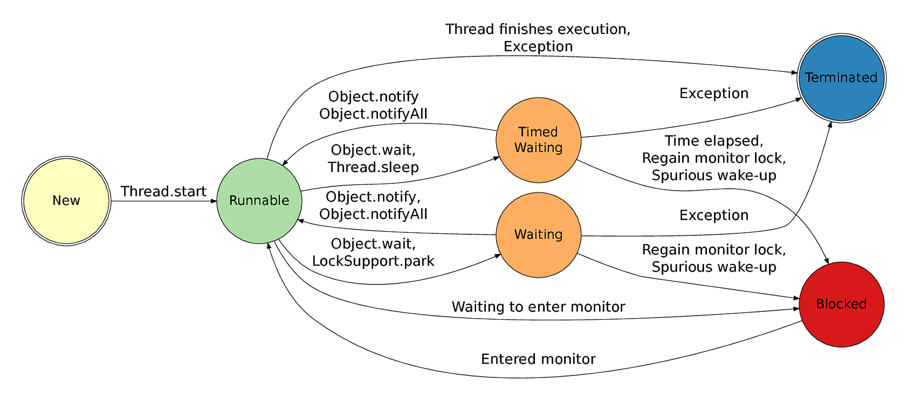

# Splash Screens 

    Course Code: ELEE1146 and COMP1836

    Course Name: Mobile Applications for Engineers/Technologists

    Credits: 15

    Module Leader: Seb Blair BEng(H) PGCAP MIET MIEEE MIHEEM FHEA

---

## Bootsplash

- AKA bootscreen
- Graphical representation Boot process of the OS
- is not necessarily designed for marketing purposes; 
- it can be intended to enhance the experience of the user as eye candy
- or provide the user with messages (with an added advantage of color-coding facility) to diagnose the state of the system.


---

## Interstital Webpage

- interstital (interval or intervening space or segment)
- displayed before or after expected content page


---

## Loading Screen

-  is a screen shown by a computer program, very often a video game, while the program is loading (moving program data from the disk to RAM) or initialising.
-  Some loading screens display a progress bar or a timer countdown to show how much data has actually loaded. Others, recently, are not even a picture at all, and are a small video or have parts animated in real time.


---

## Loading Real World: Portal 2


<!-- Portal 2 loads lots of data at the beginning and a lot of smaller files toward the end, as indicated by the spike of read ops and low bandwidth. -->

---

## Android Splash Screen


```java
new Handler().postDelayed(new Runnable() {
public void run() {
        // This method will be executed once the timer is over
        Intent i = new Intent(SplashActivity.this, MainActivity.class);
        startActivity(i);
        finish();
    }
}, 5000);
```

---

## `Handler` Class

Two main instances...

1. To schedule messages and runnables to be executed as some point in the future
2. To enqueue an action to be performed on a different thread than your own.

Send and notify state changes of your objects to other applications using an Event-driven Architecture

- you want to create a loosely coupled system
- you want to build a more responsive system
- you want a system that is easier to extend


> ref -> `https://developer.android.com/reference/android/os/Handler.html`

---

## `Handler` Class Diagram


---

## Threads/Runnerable

